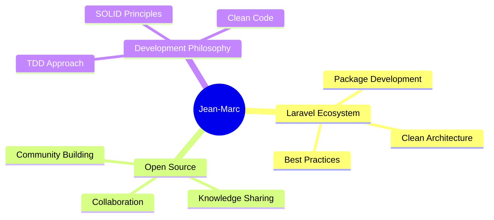

  

  
  
  

  
  
  
  

 

## 📊 GitHub Analytics

  

  
  | 📈 **Profile Details** |
  |:---:|
  |  |
  

  
  | 💻 **Languages Distribution** | 📚 **Most Used Languages** |
  |:---:|:---:|
  |  |  |
  

  
  | 📊 **GitHub Stats** | ⏰ **Productive Time** |
  |:---:|:---:|
  |  |  |
  

 

## 🛠️ Technology Stack

### Languages & Frameworks

### Tools & Environment

### Databases & Cloud

 

## 🚀 Featured Laravel Packages

> *Building the future of Laravel development, one package at a time*

### 🏗️ **Core Architecture Packages**

<table>
<tr>
<td width="50%" align="center">

<h4><strong><a href="https://github.com/grazulex/laravel-arc">laravel-arc</a></strong></h4>

<em>DTO generation made simple</em>

</td>
<td width="50%" align="center">

<h4><strong><a href="https://github.com/grazulex/laravel-flowpipe">laravel-flowpipe</a></strong></h4>

<em>Composable data pipelines</em>

</td>
</tr>
<tr>
<td width="50%" align="center">

<h4><strong><a href="https://github.com/grazulex/laravel-statecraft">laravel-statecraft</a></strong></h4>

<em>Elegant state machines</em>

</td>
<td width="50%" align="center">

<h4><strong><a href="https://github.com/grazulex/laravel-chronotrace">laravel-chronotrace</a></strong></h4>

<em>Request recording & replay debugging</em>

</td>
</tr>
 <tr> 
<td width="50%" align="center">

  
  <h4><strong><a href="https://github.com/grazulex/laravel-modelschema">laravel-modelschema</a></strong></h4>

<em>Unified YAML model schemas</em>

  
  
  

</td>  
</tr>
</table>

### 🔧 **Development & Testing Tools**

<table>
<tr>
<td width="50%" align="center">

<h4><strong><a href="https://github.com/grazulex/laravel-tddraft">laravel-tddraft</a></strong></h4>

<em>TDD made effortless</em>

</td>
<td width="50%" align="center">

<h4><strong><a href="https://github.com/grazulex/laravel-snapshot">laravel-snapshot</a></strong></h4>

<em>Smart model auditing</em>

</td>
</tr>
<tr>
<td width="50%" align="center">

<h4><strong><a href="https://github.com/grazulex/laravel-atlas">laravel-atlas</a></strong></h4>

<em>Application mapping</em>

</td>
<td width="50%" align="center">

<h4><strong><a href="https://github.com/grazulex/laravel-devtoolbox">laravel-devtoolbox</a></strong></h4>

<em>Developer utilities</em>

</td>
</tr>
</table>

### 🛡️ **Security & Operations**

<table>
<tr>
<td width="33%" align="center">

<h4><strong><a href="https://github.com/grazulex/laravel-safeguard">laravel-safeguard</a></strong></h4>

<em>Security & config validation</em>

</td>
<td width="33%" align="center">

<h4><strong><a href="https://github.com/grazulex/laravel-configrypt">laravel-configrypt</a></strong></h4>

<em>Advanced configuration encryption</em>

</td>
<td width="33%" align="center">

<h4><strong><a href="https://github.com/grazulex/laravel-turbomaker">laravel-turbomaker</a></strong></h4>

<em>Full power maker</em>

</td>
</tr>
</table>

 

## 💡 What I'm About

  

### 🎯 Current Focus
- 🔧 **Building Laravel packages** that solve real-world problems
- 📚 **Sharing knowledge** through blog posts and open source
- 🌟 **Contributing** to the Laravel ecosystem
- 🤝 **Mentoring** developers in clean code practices

 

## 🤝 Let's Connect & Collaborate

  
  
  
  
  

  
  *"Code is like humor. When you have to explain it, it's bad."* - Cory House
  

  

